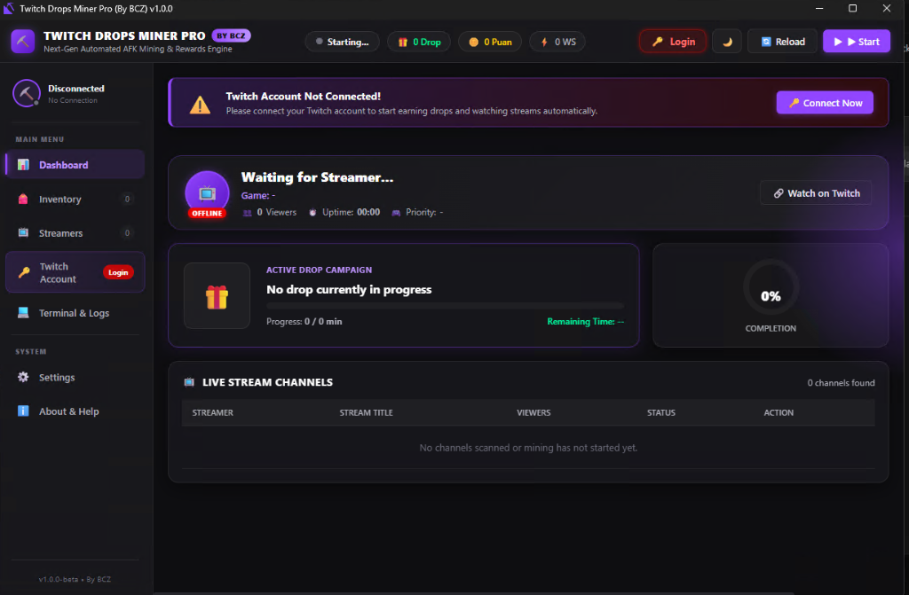
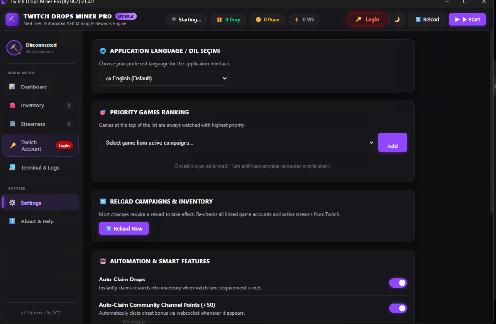

# ⛏️ Twitch Drops Miner Pro (By BCZ) — `v1.0.1-beta`

<div align="center">


**The next-generation, high-performance automated AFK reward & Twitch drops engine.**  
*Completely redesigned with an ultra-modern reactive Web GUI, multi-language engine, authoritative account linking, and intelligent drop routing.*

[📦 Releases](https://github.com/bybcz/twitchdrops/releases) • [📸 Screenshots](#-screenshots--programdan-görüntüler) • [✨ What Was Done](#-what-was-done--key-enhancements) • [📖 How to Use](#-how-to-use-step-by-step) • [🇹🇷 Türkçe Açıklama](#-türkçe-özet--kullanım-kılavuzu)

</div>

---

> [!NOTE]
> **Beta Release Status (`v1.0.1-beta`)**: This program is under active development by **By BCZ**. New features, additional language localizations, and game linking mappings are continuously updated. Feedback and contributions are welcome!
>
> 📥 **Downloads**: Pre-compiled packages (`.exe`, `.zip`, `.rar`) are available directly in the **[Releases](https://github.com/bybcz/twitchdrops/releases)** section on the right sidebar. New versions and updates are published there consecutively.

---

## 📸 Screenshots / Programdan Görüntüler

<div align="center">

### 🎮 Modern Cyber Dashboard (Canlı Panel)


### ⚙️ Settings & Localization Panel (Ayarlar & Dil Seçimi)


</div>

---

## 📋 Changelog / Güncelleme Notları

### 🚀 `v1.0.1-beta` (Latest)
- **🌍 100% Complete Localization & Zero-Leak Dynamic Translation:**
  - Resolved all hardcoded Turkish strings that previously leaked when English or other languages were selected.
  - Dynamically routes all runtime UI components through the multi-language dictionary:
    - Points counters (`Points` / `Puan` / `Punkte` / `Points` / `Puntos` / `Очки`),
    - Drop counters (`Drop` / `Дроп`),
    - Priority list empty states and button tooltips (Move Up, Move Down, Remove),
    - Streamers / Channels table live status (`LIVE` / `CANLI`), watch buttons, and empty state notices,
    - Active drop progress badges and completion markers (`Completed ✔`),
    - Status bar states (Starting, Idle, Mining Active, Mining Paused, Session Closed),
    - Toast notifications and authorization alerts.
  - Added instant reactive re-rendering (`onLanguageChanged`) whenever the language dropdown is changed, updating the active view immediately without restarting.
- **🏷️ GitHub Release Visibility & Distribution:**
  - Optimized GitHub Release publishing with `make_latest: true` so the latest version badge displays directly on the repository sidebar.
- **🖼️ Documentation Overhaul:**
  - Embedded high-resolution screenshots of the Dashboard and Settings panels directly into the repository documentation.
- **🔒 Security & Clean State:**
  - Cleaned all residual session tokens and cookies from the production distribution bundle.

---

## ✨ What Was Done & Key Enhancements

`Twitch Drops Miner Pro (By BCZ)` was born from a complete architectural overhaul of legacy miners to meet modern standards, resolve Kasada bot-protection roadblocks, and offer a user experience fit for 2026.

### 1. 🎨 Ultra-Modern Reactive Web GUI (PyWebView + CSS3 Glassmorphism)
- **Replaced the outdated Tkinter UI** with an elegant, GPU-accelerated dark theme dashboard.
- **Twitch-Inspired Cyber Aesthetics**: Glowing status pills, animated drop progress rings, live channel viewer counters, and sleek streamer cards.
- **Sidebar Tabs**: Quick access to **Dashboard**, **Active Campaigns**, **Priority List**, **Settings**, **Live Console Logs**, **Authentication**, and **About**.
- **Real-Time Stat Trackers**:
  - 🎁 Total drops claimed in session.
  - 🪙 Live Twitch channel bonus points claimed (+50 bonus button auto-clicker).
  - ⚡ Active WebSocket connection monitors.
  - ⏱️ Live mining uptime chronometer.

### 2. 🌍 Multi-Language System (Default: English)
- **Starts in English by default** on every fresh installation.
- **Seamless Runtime Switching** with zero restart required:
  - 🇬🇧 **English** (Default)
  - 🇹🇷 **Türkçe**
  - 🇩🇪 **Deutsch**
  - 🇫🇷 **Français**
  - 🇪🇸 **Español**
  - 🇷🇺 **Русский**
- Language preferences persist automatically in `settings.json`.

### 3. 🔗 Authoritative Game Account Linking (`Linked ✔` vs `Not Linked ❌`)
- **Root Cause Solved**: Legacy tools and previous versions misidentified games as unlinked or linked because Twitch's `ViewerDropsDashboard` is blocked by Kasada protection.
- **Deep Historical Claim Resolution**: The engine inspects `gameEventDrops` and user claimed reward benefits to extract verified account connections (e.g., Facepunch for Rust, EA for Apex Legends, Battle.net for Blizzard games).
- **Interactive Badges**: Both the Priority List and Campaign Grid show clickable `Linked ✔ 🔗` and `Not Linked ❌` badges.

### 4. 🎯 Direct Official Linking Redirection (No More Dead-End Pages)
- **Twitch GQL Query Enhancement**: Added `detailsURL` and `description` to public campaign queries.
- **4-Tier Intelligent URL Resolver**:
  1. **Official Developer Campaign Portal**: Direct URLs provided by game publishers (95%+ of active campaigns, e.g., *The First Descendant*, *Warframe*, *Zenless Zone Zero*, *Rise Online*, *UFL*, *Diablo IV*).
  2. **Campaign Description Regex Extraction**: Captures official linking domains embedded in campaign announcements.
  3. **Curated Game Directory**: Built-in verified account connection links for 50+ major games.
  4. **Targeted Search Fallback**: For Twitch Chat Badge campaigns that have no third-party game account, opens a smart targeted lookup rather than stranding users on generic pages.

### 5. ⏱️ Phantom Timer & Infinite Countdown Elimination
- Fixed the notorious bug where fully completed campaigns (such as Rust with all rewards collected) generated synthetic 60-minute phantom drops and locked the miner in an infinite loop.
- The engine now detects completed campaigns instantly and automatically switches to the next priority game.

### 6. 🔔 Notifications & Background Operation
- **System Tray Minimization**: Runs stealthily in the Windows system tray with customizable tooltips.
- **Audio Feedback**: Subtle chimes on successful drop claims (can be toggled in settings).
- **Webhooks**: Built-in support for Discord Webhook and Telegram Bot alerts.

---

## 📖 How to Use (Step-by-Step)

### Step 1: Launch Application
Download the latest version (`.exe`, `.zip`, or `.rar`) from the **[Releases](https://github.com/bybcz/twitchdrops/releases)** section on the right sidebar and double-click to start. No Python installation or runtime setup is required.

### Step 2: Authenticate Your Twitch Account
1. Navigate to the **Login / Account** tab (or click **Login 🔑** in the top header).
2. Choose **Device Code (Recommended)**:
   - Click **Generate Device Code**.
   - Copy the 8-character code and click the link to open [twitch.tv/activate](https://www.twitch.tv/activate).
   - Enter the code on Twitch and confirm authorization.
3. Alternatively, power users can paste their Twitch OAuth `auth-token` cookie directly.

### Step 3: Select Priority Games
1. Switch to the **Priority** tab.
2. Select your desired games from the dropdown of currently active drops campaigns and click **Add**.
3. Use the ▲ / ▼ buttons to adjust priority order. Games higher on the list will be mined first.

### Step 4: Start Mining!
- Click the purple **Start ▶** button in the header or dashboard.
- The engine will select the highest priority game, locate the best live channel with drops enabled, and start mining automatically.
- Bonus channel points (+50) and completed drops are claimed instantly.

### Step 5: Check Account Links
- In the **Campaigns** tab or **Priority** list, click on any `Not Linked ❌` badge.
- Your default web browser will immediately open that specific game's official account connection page.
- After connecting your game account, click **Reload 🔄** to refresh status.

---

## 🛠️ Project Structure

```
twitchdrops/
├── core/                        # Core Python Engine
│   ├── constants.py             # GQL Queries, Topics, App Constants
│   ├── twitch.py                # Twitch Client, Auth, GQL & Mining Loop
│   ├── inventory.py             # DropsCampaign, TimedDrop Models
│   ├── channel.py               # Channel & Stream State Manager
│   ├── websocket.py             # Multi-WebSocket Connection Pool
│   ├── settings.py              # User Settings Manager
│   ├── translate.py             # Backend Translation Engine
│   └── version.py               # Version definition (v1.0.1-beta)
├── ui/
│   ├── web_gui.py               # PyWebView Controller & Python-JS Bridge
│   └── web/                     # Reactive Frontend
│       ├── index.html           # Main Modern HTML5 Dashboard
│       ├── style.css            # Dark Glassmorphism Styling
│       ├── app.js               # Reactive State Controller
│       ├── i18n.js              # 6-Language Localization Engine
│       └── sounds/              # Audio Chimes & Feedback
├── docs/
│   └── images/                  # Screenshots (Dashboard, Settings)
├── icons/                       # Application Icons
├── lang/                        # Extended Translation Dictionaries
├── main.py                      # Application Entry Point
├── build.spec                   # PyInstaller Build Specification
└── requirements.txt             # Python Dependencies
```

---

## 💻 Building from Source

If you want to build the executable yourself:

```bash
# 1. Clone the repository
git clone https://github.com/bybcz/twitchdrops.git
cd twitchdrops

# 2. Create virtual environment
python -m venv env
.\env\Scripts\activate

# 3. Install requirements
pip install -r requirements.txt

# 4. Build single-file executable using PyInstaller
pyinstaller build.spec --clean --noconfirm
```
The resulting executable will be created at `dist/TwitchDropsMinerPro.exe`.

---

## 🇹🇷 Türkçe Özet & Kullanım Kılavuzu

### 🚀 Neler Yaptık?
1. **Modern Arayüz (Web GUI):** Eski Tkinter arayüzü tamamen kaldırılarak yerine modern, Twitch mor temalı, karanlık mod (dark glassmorphism) destekli PyWebView tabanlı web arayüzü geliştirildi.
2. **Varsayılan İngilizce & 6 Dil Desteği:** Program ilk açılışta varsayılan olarak **İngilizce** açılır. Ayarlar sekmesinden tek tıkla **Türkçe**, Almanca, Fransızca, İspanyolca ve Rusça dillerine anında geçiş yapılabilir. Dinamik arayüz elementlerindeki tüm Türkçe kaçaklar giderildi.
3. **Resmi Hesap Bağlama Sayfasına Doğrudan Yönlendirme:** Hesaba bağlı olmayan (`Not Linked ❌`) oyunların genel `twitch.tv/drops/campaigns` sayfasına düşmesi engellendi. Artık rozete tıkladığınızda doğrudan o oyunun yapımcısına ait resmi hesap bağlama sayfası (*Rise Online, Eternal Return, The First Descendant, Warframe, Diablo IV vb.*) açılır.
4. **Doğru Hesap Durumu:** Kullanıcının daha önce bağladığı hesaplar (*Rust - Facepunch, Apex - EA vb.*) envanter geçmişi taranarak tespit edilir ve doğru bir şekilde `Linked ✔` olarak işaretlenir.
5. **Rust Hayalet Süre Hatası Çözüldü:** Tüm dropları alınmış oyunlarda 60 dakikalık hayali geri sayımın sonsuza kadar dönmesi engellendi; tamamlanan oyunlar listede `Completed ✔` olarak işaretlenip sıradaki oyuna geçilir.
6. **Otomatik Ödül & Kanal Puanı Toplama:** +50 kanal bonus puanları ve %100 olan drop ödülleri arka planda otomatik olarak toplanır.

### 🎮 Nasıl Kullanılır?
1. Sağ taraftaki **[Releases](https://github.com/bybcz/twitchdrops/releases)** bölümünden güncel sürümü (`.exe`, `.zip` veya `.rar`) indirin ve çalıştırın.
2. **Login** sekmesinden **Device Code** oluşturun, kodu kopyalayıp açılan Twitch sayfasında onaylayarak giriş yapın.
3. **Priority** sekmesinden kasmak istediğiniz oyunları öncelik sırasına ekleyin.
4. Sağ üstteki veya paneldeki **Start ▶** butonuna basarak madenciliği başlatın.
5. Hesabınızı bağlamak istediğiniz oyunların yanındaki **Not Linked ❌** butonuna basarak doğrudan oyunun bağlama sitesine gidebilirsiniz.

---

## ⚠️ Disclaimer / Sorumluluk Reddi

This software is an unofficial, independent open-source automation utility and is not affiliated, associated, authorized, endorsed by, or in any way officially connected with Twitch Interactive, Inc., Amazon.com, or any of their subsidiaries or affiliates. Use responsibly.

---

## 👨‍💻 Developer & Credits

- **Developer & Creator**: **By BCZ** ([@bybcz](https://github.com/bybcz))
- **Repository**: [https://github.com/bybcz/twitchdrops](https://github.com/bybcz/twitchdrops)
- **Releases**: [https://github.com/bybcz/twitchdrops/releases](https://github.com/bybcz/twitchdrops/releases)
- **Current Version**: `v1.0.1-beta`
